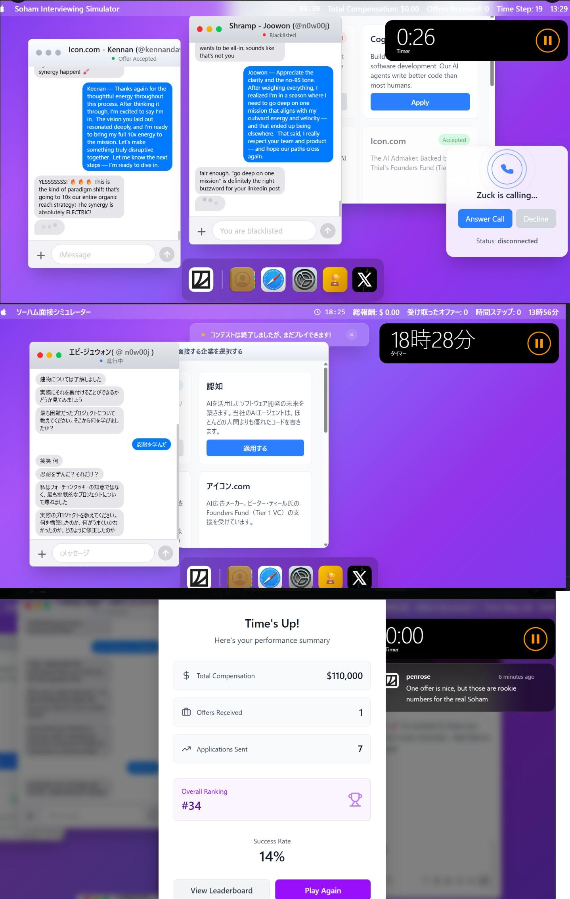

# 🎮 Soham Interviewing Simulator - 挑戦ログ / Challenge Log

[🔗 プレイはこちら / Play here](https://soham.penrose.com/)

---

## 📝 概要 / Overview

このログは、AI面接シミュレーター「[Soham Interviewing Simulator](https://soham.penrose.com/)」における私の挑戦記録です。  
単なるゲームではなく、**交渉力・判断力・感受性・戦略性**が問われる、実践的かつリアルなトレーニング環境でした。

This log records my experience in the AI-based simulator "Soham Interviewing Simulator."  
More than a game, it demanded **negotiation, adaptability, emotional intelligence, and strategic thinking.**

---

## 🏆 オファー獲得実績 / Offers Received

| 項目 / Item                         | 内容 / Details                                                         |
|--------------------------------------|------------------------------------------------------------------------|
| 💰 最高オファー額 / Top Virtual Offer | $140,000 – from Icon.com (missed confirmation by seconds)               |
| 💼 確定オファー / Finalized Offer     | $110,000 – accepted before timeout                                     |
| 🦐 shrampオファー / Offer from Shramp | shramp – “Notoriously harder than Ramp, but offer achieved!”           |
| 📨 応募社数 / Applications Sent       | 7社 / 7 companies                                                      |
| ✅ オファー獲得 / Offers Received     | 2社 / 2 companies (Icon.com – finalized in time, shramp – offer achieved) |
| 📈 成功率 / Success Rate              | 29% (including rejections, humor fails, and tough situations)           |
| 🏆 総合順位 / Global Rank             | 第34位 / Overall Rank #34                                              |

> 🦐 **shramp（SNSでも「Rampより難しい」と話題のラスボス級）からもオファー獲得！ even received an offer from a final boss level player (who is said to be "more difficult than Ramp" on social media)
> AI（Devin）は門前払いされても、GPTと共闘した“人間力＋AI戦略”で、“倒せないボス”を突破した体験です。**

## 💬 面接ログ抜粋 / Interview Highlights

> 💬 **$140,000の仮想オファーを数秒差で逃す、リアルな面接シミュレーター体験。**  
> 面接というより「交渉」だった。AIを活用しながら、相手の感触を見て判断し、場面ごとに態度を調整。  
> 結果として、**最終決定直前まで進んだ2社と、1社からのオファーを獲得。**

> 💬 **Missed a $140,000 offer by seconds — this was more negotiation than interview.**  
> I leveraged **AI tools** and human intuition to adjust tone, handle rejections, and identify when to go deep.  
> Received one confirmed offer and brought two others close to success.

---

## 🧠 所感 / Reflections

- 🤖 AIを嫌がる面接官や、冗談が通じない相手にも即応：状況判断力が試された
- 🔥 現実の就活と同じく、「熱意・誠実さ・空気を読む力」が必要だった
- 🧩 この体験は、**私の「人間らしさを活かしたAI戦略」の一つの成果**です

---

## 📸 スクリーンショット集 / Screenshots

本シミュレーターでの挑戦の様子を1枚の画像にまとめました。  
交渉、オファー獲得、タイムアウト直前の判断までを含む、リアルさ溢れる瞬間です。

---

## ✍️ ブランディングメッセージ / Final Note

🔗 この挑戦は、私の信念を示しています：  
**「人間らしさ」と「AI戦略」が就活の未来を変える。**

🔗 This log reflects my belief:  
**The future of job hunting will be shaped by human empathy + AI strategy.**

---

🧠 Written by [KG-NINJA](https://github.com/KG-NINJA)  
🏷️ #KGNINJA #AI就活 #SohamChallenge

😅 勘違いと、その先に見えたもの / Misunderstanding Turned into Message
実は私は、このゲームを最初「正統派面接シミュレーター」だと思い、
1社ごと丁寧に向き合いながらプレイしていました。

ところが後から知ったのは、「8社同時に騙して報酬を稼ぎまくったSoham Parekh」という実在の人物をモチーフにした風刺ゲームだったという事実。

つまりこのゲームの本質は――
“誠実さが報われない現代就活” への皮肉。

それでも私は、誠実にプレイして34位。
そしてshrampのような“ラスボス”からもオファーを獲得しました。

▶️ 誠実すぎるプレイが、逆に「裏技」だったのかもしれない。

I genuinely believed this was a straightforward interview simulator.
So I took my time, treated each company with respect, and focused on meaningful negotiation.

Later, I realized the whole thing was a satire — inspired by Soham Parekh, who allegedly juggled 8 jobs using AI to scam startups.

But even in a game designed to mock modern hiring chaos,
I chose to play it real.

🎯 And somehow, ranked #34 globally with only one job offer — won fair and square.

Maybe honesty… is the ultimate cheat code.

I assumed that juggling multiple startup offers was just “how the game is played” in the US.
But honestly, that approach isn't for me — and still, I reached #34 with just one honest offer.
That gave me confidence: there is still a place for integrity, even in a game like this.

